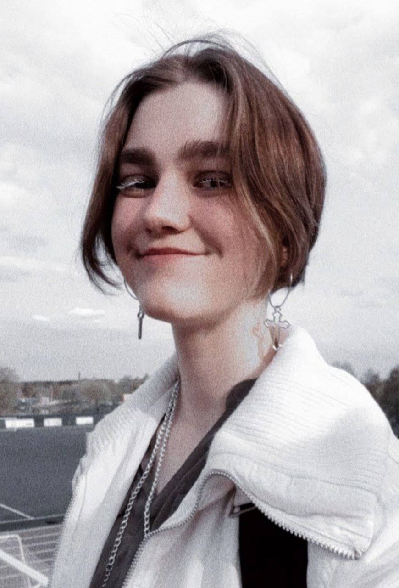

 # Lydia Lysenkova  


 


 ## Contact information:  
**Phone**: +375 (25) 707-78-83  
**E-mail**: agna.mamaeva17@gmail.com  
 **Telegram**: @tortimrrk  
 **GitHub**: [Lidiaq](https://github.com/Lidiaq)  
 [Vk](https://vk.com/ll_poteryashka_ll)  
 [Instagram](https://instagram.com/ll_poteryashka_ll?igshid=YmMyMTA2M2Y=)  


 ## About Me:  
 I am 18 years old, I am a second-year student of BNTU. I am interested in designing a website based on its design. My goal is to gain knowledge in the field of front-end development.  


 ## Skills:  
 * HTML
 * Adobe Photoshop
 * Delphi
 * PascalABC.NET  


 ## Code example:  
```procedure wwod;  
var
  i, j: integer;
begin
  for i := 1 to 4 do
    for j := 1 to n do
      a[i, j] := random(9) + 1; 
end;

procedure vivod;
var
  i, j: integer;
begin
  for j := 1 to n do
  begin
    write('     ', j:4, '    |       ');
    for i := 1 to 4 do
      write(a[i, j], '   '); 
    writeln;
  end;
end;
```  


## Work experience:  
*Nothing yet.*  


## Education:  
**University**: Belarusian National Technical University, Specialty "Vocational training (computer science)"  

## Language:  
**English level**: A1-A2